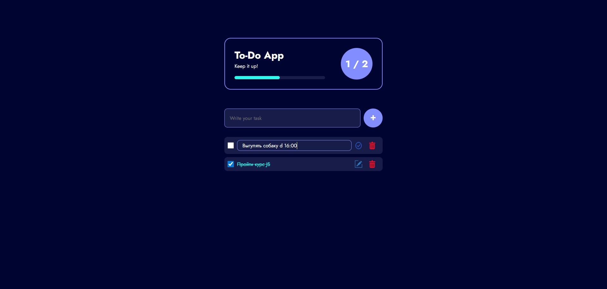

# **To-Do List приложение на JS**
 

Проект выполнен с целью закрепления полученных навыков программирования на JavaScript

___

## **Функционал**
- Добавление, удаление и редактирование задачь
- Отслеживание сколько всего задачь и сколько из них выполненно
- Изображение progress-bar'а 
- Фейерверк по достижению всех целей
___

## **Запуск приложения**
> Перейти по ссылке: https://danielfilimonov.github.io/To-Do-App/
 
___

## Демонстрация работы приложения
